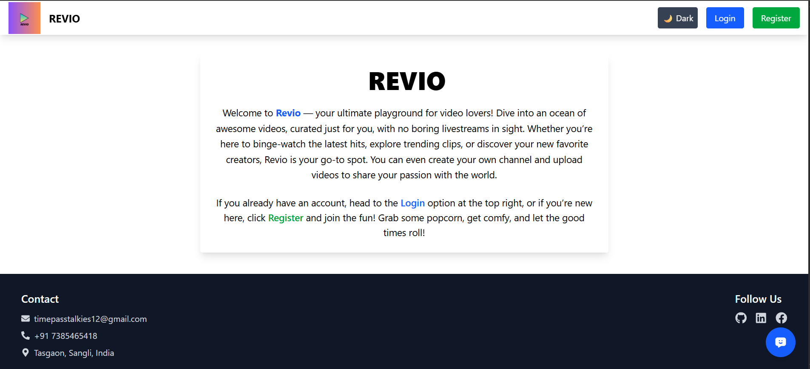
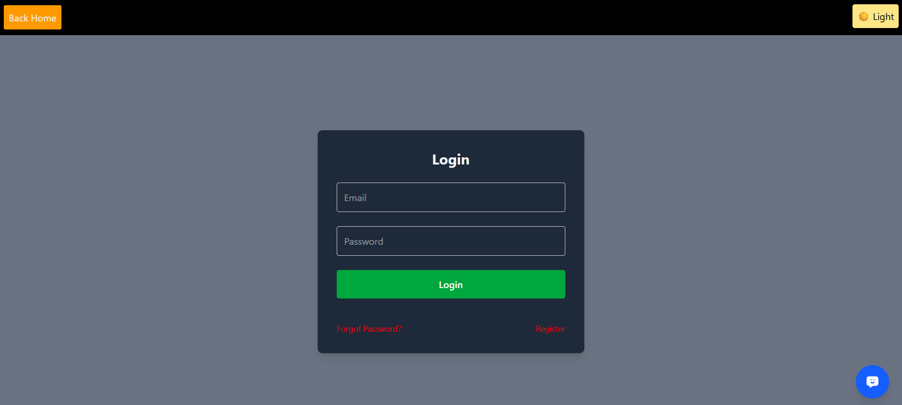
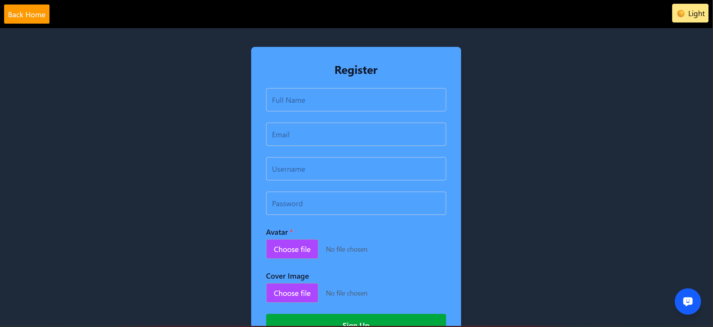
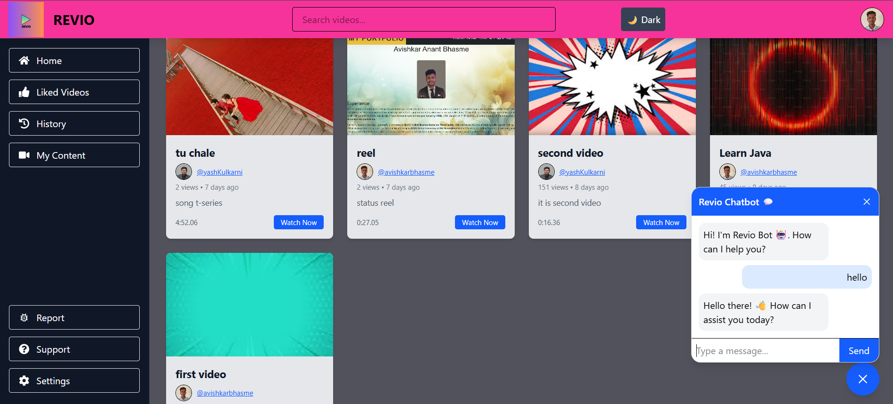
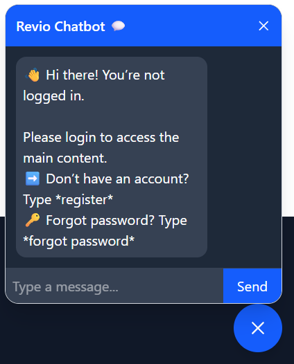
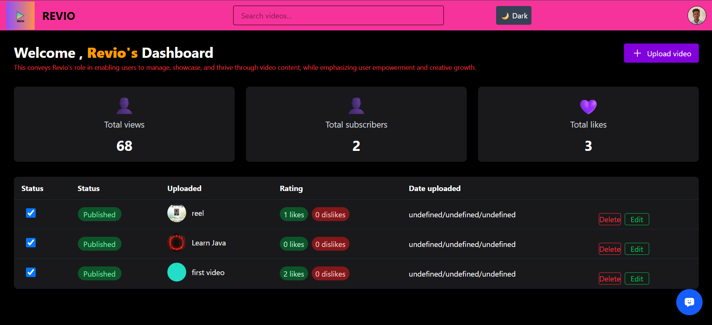
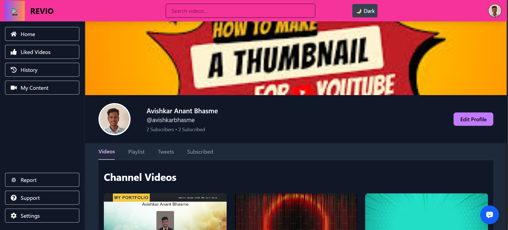
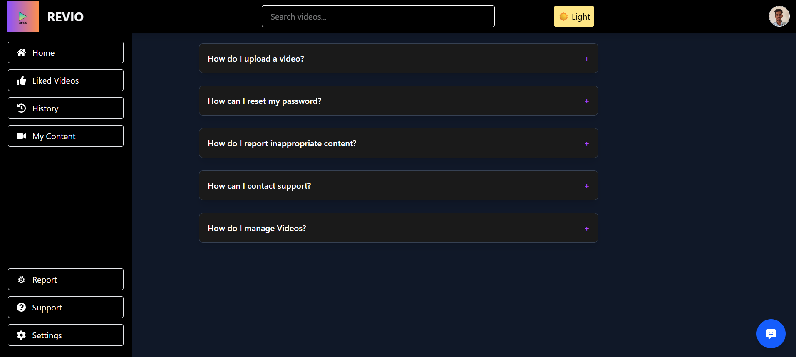
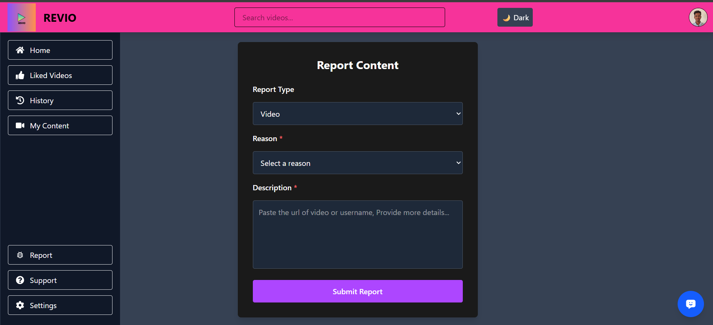
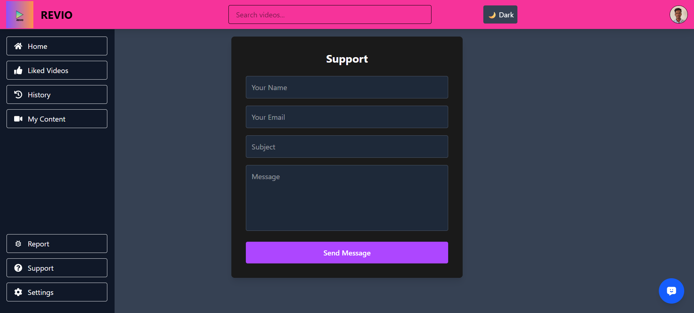

# Revio

Revio is a modern web application for sharing and exploring video content. It allows users to upload videos, interact with content through likes, comments, and reports, and provides an admin panel for moderation and management.

---
# Screenshots
## Home


## Login


## Register 


## Main Content


## Chatbot


## Dashboard


## Profile


## Help


## Report


## Support



## Features

### User Features
- User registration and login.
- Upload, view, and manage videos.
- Chatbot.
- Like, comment, and share videos.
- Report inappropriate content.
- Support page for user queries.


### Technical Features
- Frontend: React, TailwindCSS
- Backend: Node.js, Express
- Database: MongoDB
- Image & Video Management: cloudinary
- Authentication: JWT (for users)
- RESTful APIs for seamless frontend-backend integration

---

## Installation

### Prerequisites
- Node.js v18+  
- MongoDB Atlas 
- Express.js

### Backend Setup
1. Navigate to backend directory:
    ```bash
    cd backend
    ```
2. Install dependencies:
    ```bash
    npm install
    ```
3. Create a `.env` file and add:
    ```env
    PORT=8000
    MONGO_URI=your_mongodb_uri
    JWT_SECRET=your_secret_key
    ```
4. Start the backend server:
    ```bash
    npm run dev
    ```

### Frontend Setup
1. Navigate to frontend directory:
    ```bash
    cd frontend
    ```
2. Install dependencies:
    ```bash
    npm install and npm vite
    ```
3. Start the frontend server:
    ```bash
    npm run dev
    ```

---

## Folder Structure


Revio/
│
├── backend/ # Node.js backend
│ ├── controllers/ # API controllers
│ ├── models/ # Database models
│ ├── routes/ # API routes
│ └── server.js # Entry point
│
├── frontend/ # React frontend
│ ├── src/
│ │ ├── components/ # React components
│ │ ├── pages/ # Page components
│ │ ├── utils/ # Utility functions
│ │ └── App.jsx
│
└── README.md # Project documentation

## Contact

For support or questions, reach out via support page on the website or email at `timepasstalkies12@gmail.com`.
